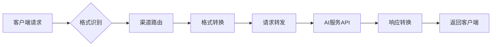

# OpenAI Proxy Monitor (AI Gateway)

一个基于Rust和Pingora框架构建的高性能AI服务网关，支持多种AI提供商之间的智能格式转换和负载均衡。

## ✨ 核心特性

### 🎯 智能格式转换
支持主流AI服务之间的无缝格式转换：
```
OpenAI ↔ Anthropic ↔ Gemini
  ↑         ↑         ↑
  └─────────┼─────────┘
            │
        任意互转
```

- **自动格式识别**：根据请求路径、Header和参数智能识别API格式
- **透明转换**：请求/响应格式自动转换，对客户端完全透明
- **流式支持**：完整支持SSE流式响应的实时格式转换

### ⚖️ 智能路由与负载均衡
- **渠道映射**：API Key到特定渠道的智能映射
- **负载均衡**：支持轮询、加权随机、最少连接数、故障转移等策略
- **自动故障转移**：主渠道失败时自动切换到备用渠道

### 📊 监控与限流
- **Prometheus指标**：完整的请求监控和使用量统计
- **滑动窗口限流**：基于token数量的精确限流控制
- **用户级限流**：支持按用户进行独立的速率限制

## 🚀 快速开始

### 环境要求
- Rust 1.75+
- 依赖 `ai-api-converter` 库（需要在相邻目录 `../ai-api-converter`）

### 安装运行

```bash
# 开发环境运行
RUST_LOG=info cargo run --release

# 生产环境运行
OPENAI_TLS=true OPENAI_PORT=443 OPENAI_DOMAIN="api.openai.com" cargo run --release
```

### 配置参数

| 环境变量 | 默认值 | 说明 |
|---------|--------|------|
| `PROXY_PORT` | 8080 | HTTP代理端口 |
| `METRICS_PORT` | 9090 | Prometheus指标端口 |
| `OPENAI_DOMAIN` | api.openai.com | OpenAI API域名 |
| `OPENAI_PORT` | 443 | OpenAI API端口 |
| `OPENAI_TLS` | true | 是否启用TLS |
| `ENABLE_RATE_LIMITING` | false | 是否启用限流 |
| `RATE_LIMIT_WINDOW_MIN` | 60 | 限流窗口（分钟） |
| `MAX_TOKENS` | 1000 | 最大token数/窗口 |

## 📖 使用示例

### OpenAI格式请求
```bash
curl -X POST http://127.0.0.1:8080/v1/chat/completions \
  -H "Authorization: Bearer sk-your-api-key" \
  -H "Content-Type: application/json" \
  -d '{
    "model": "gpt-4o",
    "messages": [{"role": "user", "content": "Hello, world"}],
    "stream": true
  }'
```

### Anthropic格式请求（自动转换）
```bash
curl -X POST http://127.0.0.1:8080/v1/messages \
  -H "x-api-key: your-anthropic-key" \
  -H "anthropic-version: 2023-06-01" \
  -H "Content-Type: application/json" \
  -d '{
    "model": "claude-3-opus",
    "max_tokens": 1024,
    "messages": [{"role": "user", "content": "Hello, world"}]
  }'
```

### Google Gemini格式请求（自动转换）
```bash
curl -X POST http://127.0.0.1:8080/v1beta/models/gemini-pro:generateContent \
  -H "x-goog-api-key: your-google-key" \
  -H "Content-Type: application/json" \
  -d '{
    "contents": [{"parts": [{"text": "Hello, world"}]}]
  }'
```

### Python客户端
```python
from openai import OpenAI

# 使用网关，自动处理格式转换
client = OpenAI(
    base_url="http://localhost:8080",
    api_key="your-api-key",
    default_headers={"user": "user1"}  # 用于限流识别
)

response = client.chat.completions.create(
    model="gpt-4o",  # 或 claude-3-opus, gemini-pro 等
    messages=[{"role": "user", "content": "Hello"}],
    stream=True
)
```

## 🔧 架构设计

### 核心转换流程


### 模块结构
```
src/
├── main.rs              # 程序入口和CLI参数解析
├── http_proxy/
│   ├── mod.rs           # HTTP代理模块
│   ├── config.rs        # 配置和HttpGateway初始化
│   ├── proxy.rs         # 核心代理逻辑和智能转换
│   ├── parsing.rs       # 请求/响应解析
│   ├── types.rs         # 数据类型和路由规则
│   └── metrics.rs       # Prometheus指标收集
├── rate_limiter.rs      # 滑动窗口限流器
└── utils.rs             # 格式识别工具函数
```

## 🎛️ 高级配置

### 智能路由规则
系统内置以下路由规则：
- `gpt-*`, `o1-*` → OpenAI服务
- `claude*` → Anthropic服务
- `gemini*` → Google服务

### 负载均衡策略
- **轮询**：请求平均分配到各渠道
- **加权随机**：根据渠道权重随机选择
- **最少连接**：选择连接数最少的渠道
- **故障转移**：优先使用主渠道，失败时切换备用

### API Key管理
- 支持API Key到渠道的直接映射
- 支持多个API Key绑定到同一渠道
- 安全的哈希存储，不明文保存API Key

## 📊 监控指标

访问 `http://localhost:9090/metrics` 查看Prometheus指标：

- `http_requests_total` - 总请求数
- `http_request_duration_seconds` - 请求延迟
- `token_usage_total` - Token使用量统计
- `rate_limit_exceeded_total` - 限流触发次数

## 🧪 测试

```bash
# 运行所有测试
cargo test

# 运行带调试输出的测试
RUST_LOG=debug cargo test

# 代码格式检查
cargo fmt

# 代码质量检查
cargo check
```

## 🤝 贡献指南

1. Fork 本仓库
2. 创建特性分支 (`git checkout -b feature/amazing-feature`)
3. 提交更改 (`git commit -m 'Add some amazing feature'`)
4. 推送到分支 (`git push origin feature/amazing-feature`)
5. 创建 Pull Request

## 📄 许可证

本项目采用 MIT 许可证。详见 [LICENSE](LICENSE) 文件。

## 🔗 相关链接

- [Pingora Framework](https://github.com/cloudflare/pingora)
- [AI API Converter](../ai-api-converter) - 格式转换库
- [Prometheus](https://prometheus.io/) - 监控指标

---

**注意**: 本项目依赖 `ai-api-converter` 库，请确保该库位于 `../ai-api-converter` 目录中。